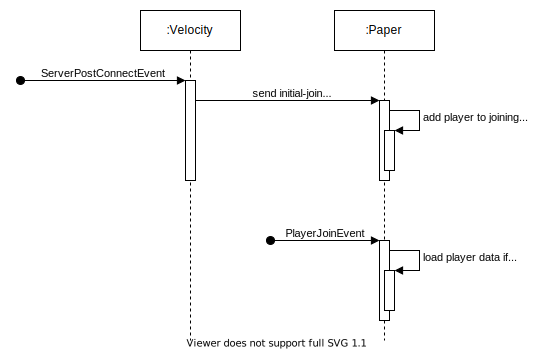
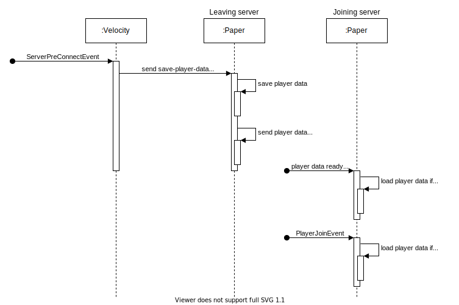

<div align="center">
  <a href="https://github.com/kryoniteorg/kryo-player-sync">
    
  </a>
</div>

<h1 align="center">kryo-player-sync</h1>
<div align="center">
    A plugin to sync player data over multiple <a href="https://github.com/PaperMC/Paper">Paper</a> servers.
    <br />
    <br />
    <a href="https://github.com/kryoniteorg/kryo-player-sync/issues/new?assignees=&labels=bug&template=bug_report.md">Report Bug</a>
    ·
    <a href="https://github.com/kryoniteorg/kryo-player-sync/issues/new?assignees=&labels=feature&template=feature_request.md">Request Feature</a>
    <br />
    <br />
    
    
    
    
    
    <br />
    <br />
</div>


## About the project

kryo-player-sync is combination of a Velocity proxy plugin and a Paper plugin which syncs player related data such as their inventory, coins and more.

## Prerequisites
kryo-player-sync needs the following services to be installed and configured to function properly:

- [MariaDB](https://mariadb.org/) database
- [RabbitMQ](https://www.rabbitmq.com/) message broker

It is not recommended using the root user of the [MariaDB](https://mariadb.org/) server for kryo-player-sync. Please create an extra database with an extra user that is limited to that database.

## Functionality
The following images illustrate the workflow when a player joins the network and when a player switches from one [Paper](https://github.com/PaperMC/Paper) server to another [Paper](https://github.com/PaperMC/Paper).



## Setup
### Velocity
To install the [Velocity](https://github.com/PaperMC/Velocity) plugin just copy the JAR-file into the plugin directory.

A startup command of [Velocity](https://github.com/PaperMC/Velocity) could look like the following:
```bash
java -Xms128M -Xmx1024M -XX:+UseG1GC -XX:G1HeapRegionSize=4M -XX:+UnlockExperimentalVMOptions -XX:+ParallelRefProcEnabled -XX:+AlwaysPreTouch -XX:MaxInlineLevel=15 -jar velocity.jar
```

### Paper
To install the [Paper](https://github.com/PaperMC/Paper) plugin just copy the JAR-file into the plugin directory.

Furthermore, the [Paper](https://github.com/PaperMC/Paper) plugin needs some environment variables. Those can also be provided as startup parameters if the usage of environment variables is not possible.

| Environment variable | Start parameter     | Description                                              |
|----------------------|---------------------|----------------------------------------------------------|
| CONNECTION_STRING    | -DCONNECTION_STRING | Connection String for connecting to the MariaDB database |
| RABBITMQ_ADDRESS     | -DRABBITMQ_ADDRESS  | Address and port of the RabbitMQ message broker          |
| RABBITMQ_USERNAME    | -DRABBITMQ_USERNAME | Username of the RabbitMQ message broker                  |
| RABBITMQ_PASSWORD    | -DRABBITMQ_PASSWORD | Password of the RabbitMQ message broker                  |

A startup command of [Paper](https://github.com/PaperMC/Paper) could look like the following:
```bash
java -XX:MaxRAMPercentage=90.0 -XX:+UseG1GC -XX:+ParallelRefProcEnabled -XX:MaxGCPauseMillis=200 -XX:+UnlockExperimentalVMOptions -XX:+DisableExplicitGC -XX:+AlwaysPreTouch -XX:G1HeapWastePercent=5 -XX:G1MixedGCCountTarget=4 -XX:G1MixedGCLiveThresholdPercent=90 -XX:G1RSetUpdatingPauseTimePercent=5 -XX:SurvivorRatio=32 -XX:+PerfDisableSharedMem -XX:MaxTenuringThreshold=1 -XX:G1NewSizePercent=30 -XX:G1MaxNewSizePercent=40 -XX:G1HeapRegionSize=8M -XX:G1ReservePercent=20 -XX:InitiatingHeapOccupancyPercent=15 -Dusing.aikars.flags=https://mcflags.emc.gs -Daikars.new.flags=true -DSERVER_NAME=xxx -DCONNECTION_STRING=jdbc:mariadb://127.0.0.1:3306/database?user=user&password=password -DRABBITMQ_ADDRESS=127.0.0.1:5672 -DRABBITMQ_USERNAME=guest -DRABBITMQ_PASSWORD=guest -jar server.jar nogui
```

## Development

### Building
kryo-player-sync is built with [Gradle](https://gradle.org/). We recommend using the included wrapper script (`./gradlew`) to ensure you use the same [Gradle](https://gradle.org/) version as we do.

To build production-ready JAR files it is sufficient to run `./gradlew shadowJAR`.
You can find the JAR files in `./velocity/build/libs/*-all.JAR` and `./paper/build/libs/*-all.JAR`.

### Testing
kryo-player-sync uses JUnit 5 and Mockito for testing.

To run all tests just execute `./gradlew test`
